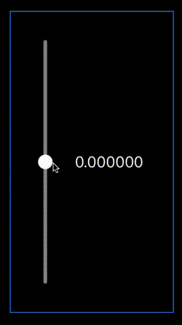

# CenterOriginSlider 

CenterOriginSlider is an open-source SwiftUI package that provides a customizable center origin slider for your iOS projects. 
This slider allows users to select values in a range, either negative or positive, from a center origin point.
CenterOriginSlider can be used vertically and horizontally.

This package provides a variety of customization options such as thumb size, color, guide bar style, tracking bar color, and more, making it a flexible choice for your user interface needs.

## Features

- Set the upper and lower bounds of your slider.
- Opt to increment values discretely or continuously.
- Set the orientation to horizontal or vertical.
- Customize the slider's thumb size, color, and shadow.
- Style the guide bar with your choice of corner radius, color, and height.
- Define the appearance of the tracking bar, including its color and height.

## Requirements

- iOS 14.0+
- mac OS 11.0+

## Installation

CenterOriginSlider is available through the Swift Package Manager. 

To add CenterOriginSlider to your Xcode project:
1. Select File > New > Package...
2. Enter `https://github.com/thompson-dean/CenterOriginSlider.git` into the package repository URL text box.
3. Follow the prompts to add the package to your project.

## Usage

First, import the `CenterOriginSlider` package in the file where you want to use it:

```swift
import SwiftUI
import CenterOriginSlider
```

```
struct ContentView: View {
    @State private var value: CGFloat = 0.0

    var body: some View {
        CenterOriginSlider(
            .horizontal,
            value: $value,
            range: -100...100
        )
    }
}
```


CenterOriginSlider also takes whole number and decimal increments.

```
CenterOriginSlider(
    .horizontal,
    value: $value,
    range: -100...100,
    increment: .fixed(5)
)
```


To further customize the slider, you can specify other properties as per your needs. For example:

```
CenterOriginSlider(
.horizontal,
value: $value,
range: -25...25,
increment: .none,
thumbSize: 32,
thumbColor: .white,
centerPointSize: 18,
guideBarCornerRadius: 16,
guideBarColor: .purple,
guideBarHeight: 32,
trackingBarColor: .yellow,
trackingBarHeight: 16,
shadow: 1,
shadowColor: .black
)
```


**Warning:** Make sure to set the range with an upper and lower bound are symmetrical. i.e. -100...100.

## Contribution
Contributions to the CenterOriginSlider project are welcome! Feel free to open a new issue or send a pull request, if you happen to find a bug, or would liek to add any new features.

## License
CenterOriginSlider is available under the MIT license.
